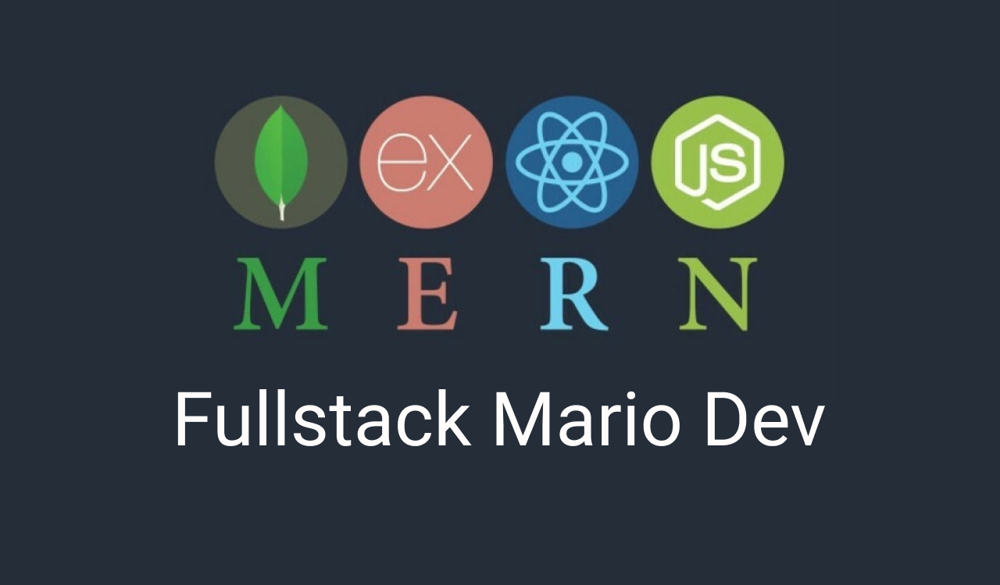

# MERN backend

## Ссылка на урок

[YouTube MERN backend](https://youtu.be/aOpK-J98UH0)

## Настройка проекта

- в папке config => создайте фаил .env
  => поместите туда `MONGO_URI=url_db` и `PORT=5000`

## Запуск проккта

`yarn | npm start`
